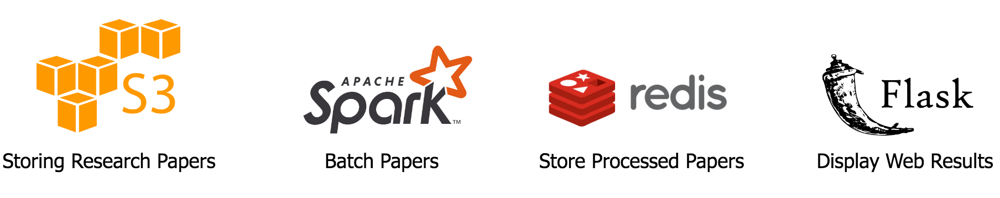

# Velma 

Words move people.  

## Motivation 
Think about the last time you read a job description. This is the first front between you and the rest of the company. The analagous for researchers is the paper abstract. Like a company, researchers want to connect to people through their work. Unfortunately, most people don't get past the paper abstract. So the question is: how do we write abstracts that are not only concise and compelling, but also connects us to the right person? This is what I built Velma for. 

Velma is a pipeline for 45 million research papers that provides examples of high quality abstracts from top papers in Computer Science, Neuroscience, and Biomedical. 

## How does it work? 

<a href="http://54.201.232.247/">Velma</a>

Say I'm a computer scientist writing a paper on reinforcement learning. I want to pull up a few examples of abstracts so I can have a sense of what works well. Say I know the abstract from "Mastering the game of Go without human knowledge" has a great abstract. I'll provide the title "Mastering the game of Go without human knowledge" to Velma, and Velma will provid me not only with the abstract from "Mastering the game of Go without human knowledge", it will also provide me with 5 additional abstracts that are similar to the abstract from "Mastering the game of Go without human knowledge". Now, I have not only one but six examples of good abstracts I can use as templates to write my own abstract. If you've convinced your reader to continue past the abstract, our work is done and yours is just starting.

## Under the hood
We use a lot of papers. Papers are collected from the Open Research Corpus (~45 million) from three main categories -- CS, neuroscience, biomedical -- and are stored as raw text files in AWS S3. Then, the papers are preprocessed into a large dataframe, where each row is a paper and each column is a feature of that paper like id, title, abstract, number of citations, and tags. Spark is used because we want to distribute the work to multiple workers, saving time and solving out of memory issues. After data driven filtering by number of citations and relevant tags, Velma compares the simililarity of abstracts using the Jaccard Index, a measure of word choice similarity. For each abstract, we find the top 5 most similar abstracts and stores these as key value pairs in Redis because we need fast query speeds. Redis is perfect for this because of its key-value based store and constant time access. To display Velma's abstracts, we use Flask as a because of its template based development, allowing for a wide range of customization as well as "just working". 

Velma will provide abstracts using the common language of your field, so you can be confident that you're using the right words.

## Tech Stack

## Data Source
- Open Research Corpus: CS, Neuroscience, Biomedical [125GB] [direct download] [.txt files]

## Main Features 

### Gimmie a title 
The user will enter the title of a paper and Velma will provide not only the abstract from that paper but 5 additional abstracts that are most similar to it. For example, the user enters "Mastering the game of Go without human knowledge". Velma will search through the database for that paper. If it exists in the database, Velma display 5 additional abstracts that are most similar to the abstract from "Mastering the game of Go without human knowledge". 

## Engineering Challenge
Comparing the jaccard index of each paper to every other paper is O(n^2). With 45,000,000 research papers, this task is impossible -- on the order of 2 quadrillion computations. (That's a 2 followed by 15 zeros!) So what next? Taking a closer look at the data, we determined three filters that not only reduced the number of computations but also increased the quality of the abstracts 

### Abstracts 
- The data isn't very clean. Roughly 35% of papers from the data did not contain abstracts. So we drop them. 

### Citations 
- Only about 13% of papers have more than 10 citations. Since we're in the business of top papers and its much more likely that a user will give Velma a high quality paper, we decide to only store these top papers in our database. 

### Tags 
- You don't want to waste your time comparing papers about gene splicing to papers to database architecture. For this reason, we only compare papers that share at least one tag. This way, only papers that are relevant to each other will compared to each other. 

With these three filters, we are able to reduce our computation by 9 orders of magnitude from 2 quadrillion to 60 million computations, distributed across 4 Spark workers. We were not only able to reduce our computation time by a significant amount, we were also able to provide higher quality abstracts to our user. Everyone is happy! 

## In the works! 

### Next Steps 

#### Keyword
The user will enter a keyword(s) that they want in their abstract. For example, the user inputs = "deep learning". Velma will scan through the database, pull every abstract with the keyword "deep learing", sort them by highest citation, take the top 20% of these papers, compute the jaccard index, and display the 5 papers with the highest jaccard index.  

#### Tagged  
A user will enter a tag(s) and Velma will provide the top 5 abstracts with those tags. For example, the user inputs the tag = "biomedical". Velma will look through only the abstracts with the tag = "biomedical", compute the jaccard index for the top 20% of papers and display the top 5. 

#### Year by year 
Allows the user to filter by year. Ex. only look at the papers from 2015-2019. 

#### Adding papers
There are potentially millions of other papers from other domains on sites like arXiv, Academia, and PubMed (> 200GB)

### Long term vision 

#### Adding other categories
Expanding Velma’s service to other summary type writings like job descriptions, executive summaries, and intros to articles. 

#### Weighted Graphing
There are many other features to a paper that indicate quality papers and possibly good abstracts. What if you could weight the suggestions by author, out citations, or title? 

#### Augmented writing
Provide examples and learn how to recommend good words and style for people. What if Velma could recommend ways to write your abstract, intro paragraph, or executive summary while keeping your distinct voice? 

## Credits 
I big thank you to Insight and the DE SEA 19A Fellows for your help and constant feedback, without which this project would not have been possible. Special thanks to Sriram, Curtis, Hoa, and the rest of Insight Data Science staff. 

