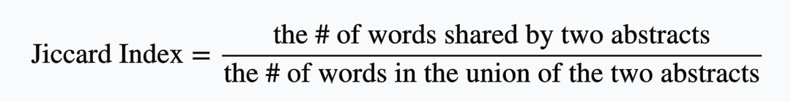
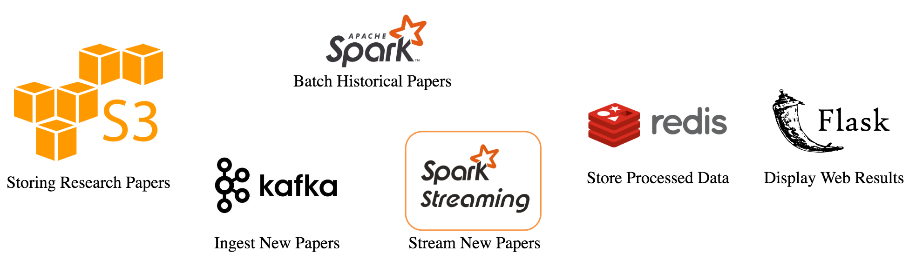

# Velma 

@(Insight Data Engineering)

Words move people. 

## Motivation 
The right words make all the difference. Your paper's abstract or summary is the gateway to your work; it likely the single largest deciding factor in whether a reader will continue to read your paper. We believe in learning by example. 

Velma is a pipeline for 45 million academic research papers that provides the best example of abstracts based on: 

1) Number of citations 
2) Year 
3) Similarity to abstracts from other top papers in your field 

If you've convinced your reader to continue past the abstract, our work is done and yours is just starting.  

## Project description 
We use a lot of papers. Papers are collected from the Open Research Corpus and arXiv (~45 million, ~250 GB) from three main categories -- CS, neuroscience, biomedical -- and stored in AWS S3. The data sets are joined, abstracts are connected to their year and number of citations, and then sorted -- all using Spark. We consider a good paper one that has a high number of citations within its field. 

Most top papers have good abstracts. However, some papers are good in spite of bad abstracts. We want to provide abstract formats that are tried and true. Velma will take the top 10,000 papers from the last 5 years and compare them to one another through the Jiccard Index, providing a measure of word choice similarity. Velma will provide abstracts using the common language of your field, so you can be confident that you're using the right words.  

Staying up to date is also important. According to the NSF, it's estimated that around ~2 million new papers are published each year. That's why Velma supports streaming. Every month, when arXiv updates its collection of papers, Velma ingests and processes these new papers using Kafka and Spark Streaming. 

We store all of our data in Redis, which is great for text-based queries. To display Velma's top abstracts,  we use Flask as a simple web interfacing tool. 

## Tech Stack

## Data Source
- Open Research Corpus: CS, Neuroscience, Biomedical [46GB] [direct download] [.txt files] 
- arXiv [190GB] [Amazon S3] [source files in TeX/LaTeX]

## Engineering Challenge
- Combining two or more large data sets (>50 GB)
- Extracting the abstract and number of citations from each paper
- Streaming data when new papers come in [updated monthly in ArXiv]
- Computing the similarity 

## Business Value
Words move people. Say your company is hiring and posts a job description to LinkedIn. Similar to abstracts, a job description is typically the first front between a company and a potential hire. There's a lot of jobs and a lot of people out there, so it's important for your company to communicate its job opening, mission, and values succinctly -- all of which are aimed to connect you to the right person for the job. The role of the abstract for researchers is no different. We could all gain from being a little clearer. 

As the world continues to grow, so will the amount of data in it. You'll want examples of what works, and Velma is your a real-time data collection and processing pipeline to help you do just that. 

Velma is made for academics, but choosing the right words is for everyone. 

## MVP
Move the Open Research Corpus and arXiv to S3, join the two datasets, map the abstracts to their citations, years and field, store this information in Redis, compute the Jiccard Index for the top 10,000 abstracts by citation (< 0.0002%) from computer science from the last 5 years, display from that subset the top 10 abstracts with the highest Jiccard Index on Flask. 

## Stretch Goals
- Add more research papers from other data sources [Ask Neil]
- Validate and implement a weighted graph system that 
- Scale the number of abstracts that can be compared efficiently 

## Appendix 
#### Other sorting algorithms 
- Jaccard index: the size of the intersection divided by the size of the union of two label sets
- Sorensen-Dice: Find the common tokens, and divide it by the total number of tokens present by combining both sets
- Ratcliff-Obershelp similarity: Find the longest common substring from the two strings. Remove that part from both strings, and split at the same location. This breaks the strings into two parts, one left and another to the right of the found common substring. Now take the left part of both strings and call the function again to find the longest common substring. Do this too for the right part. This process is repeated recursively until the size of any broken part is less than a default value. Finally, a formulation similar to the above-mentioned dice is followed to compute the similarity score. The score is twice the number of characters found in common divided by the total number of characters in the two strings. 

## Credits
Tech Stack Picture: kellielu; Appendix info: "String similarity — the basic know your algorithms guide!" by Mohit Mayank, itnext. Feb. 2, 2019.

