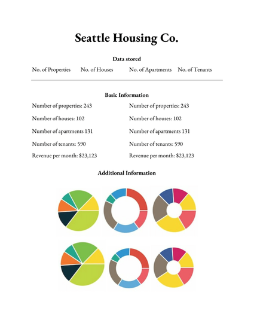

# One: Insight Data Engineering Project
Filling the gap between a one sentence summary and a 200 million entry table 

## Description
Condense your company's data into a one page executive summary. 

## Result

## How does it work?
Imagine you are a Seattle housing company and want to find out what kind of data you have in a clear and concise way. Submit your company data to us, and we will produce a one page executive summary of your data: 

1) Categories of your data. Ex. Houses, apartments, tenants, addresses 
2) Basic information about your data. Ex. no. of houses = 123, no. of apartments = 231
3) Basic statistics about your data. Ex. no. of tenants by month = 95

## Architecture

## Engineering challenges 
- Ingesting from one or more data sources 
- Creating a system that is fault tolerant as data scales 

## MVP
Ingest multiple data sources of Seattle housing and generate a one page executive summary

## Stretch goals 
- Allow for larger data sources (Ex. 1GB, 10GB, 100GB, 1TB)
- Scale with a larger number of data sources (Ex. 2, 5, 10, 100)
- Allow user to choose which parts they want to include in the executive summary

