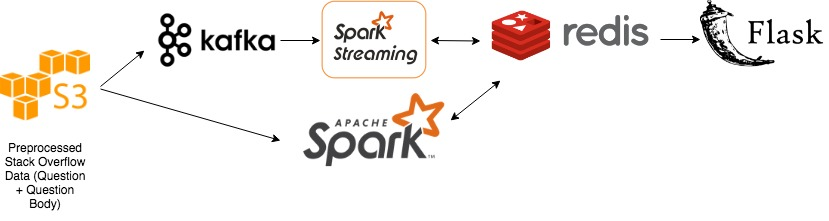

# Velma 

Words move people. 

## Motivation 
The right words make all the difference.

Velma is a text-based similarity pipeline for 45 million academic research papers that presents abstracts with the highest citations and tests their similarity using the Levenshtein distance to answer questions such as: 

1) What do abstracts from the best papers look like? 
2) How can I write my abstract so more people will read my paper? 
3) What are the historical trends of the abstracts from the best papers? 

This project is inspired by local Seattle company, Textio -- a company focused on augmented writing for job descriptions. 

## Project description 
I will store research papers from Semantic scholar and arXiv [total 250 GB] into AWS S3. I will join the two data sets using Spark and extract the abstract and number of citations. 

For the top 10,000 papers, I will then compare each abstract to each of the others [O(n!)] through the Levenshtein distance by domain. This method was invented in 1965 by the Russian Mathematician Vladimir Levenshtein (1935-2017). The distance value describes the minimal number of deletions, insertions, or substitutions that are required to transform one string (the source) into another (the target). 

Ex. Levenshtein distance of "test" to "text" is 1 (one substitution). 

This calculation provides information on the similarity of abstracts. If the abstracts are similar, abstracts could be a good indicator of number of citations. If they're not very similar, then a) maybe abstracts aren't a good indicator for citations; b) the domains of the papers are not similar enough; c) the similarity algorithm is not good enough. 

When new research papers come in, I will use Kafka and Spark Streaming (not completely necessary for this project since arXiv only updates monthly, but will be crucial for companies that get new data daily or instantly) 

## Tech Stack

- AWS S3 [Storing Open Research Corpus and arXiv data]
- Kafka [Ingesting data from Open Research Corps; arXiv already in S3]
- Spark [Batch Processing on historic data]
- Spark Streaming [Stream Processing on new data]
- Redis (or ElasticSearch) [Database; good for storing and searching text data]
- Flask [Web; seems like the simplest to use]

## Data Source
- Open Research Corpus: CS, Neuroscience, Biomedical [46GB] [direct download] [.txt files] 
- arXiv [190GB] [Amazon S3] [source files in TeX/LaTeX]

## Engineering Challenge
- Combining two or more large data sets (>50 GB)
- Extracting the abstract and number of citations from each paper
- Streaming data when new papers come in [updated monthly in ArXiv]
- Computing the similarity 

## Business Value
There are many use cases. For example, Textio is a Seattle company focused on augmented writing for job descriptions. New job postings are put up every day on Indeed, LinkedIn, Glassdoor, etc. How do you write a good job description so that you have a higher probability of getting good talent? I have created a pipeline that can take historic data and do real time streaming on these postings. The pipeline will allow data scientists and ML engineers to easily access the data and test their models on what job descriptions work well and ultimately provide insight into how a company would write a good job postings. Other use cases include ingesting text-based data like real-time Amazon reviews, traffic updates, and news articles for a wide range of purposes. 

## MVP
Join the two datasets together, extract the top 1,000 abstracts along with their citations, and compute the Levenshtein distances. 

## Stretch Goals
- Add more research papers
- Categorize research papers by domain (Ex. CS, Biomedical, Neuroscience)
- Categorize research papers by year (Ex. 1987, 1999, 2018)
- Validate and implement a more sophisticated similarity system [Jaccard index, Sorensen-Dice, Ratcliff-Obershelp similarity]
- Display top abstracts by domain
- Compute similarity by domain
- Scale the number of abstracts that can be compared efficiently 

## Appendix 
- Jaccard index: Find the number of common tokens and divide it by the total number of unique tokens
- Sorensen-Dice: Find the common tokens, and divide it by the total number of tokens present by combining both sets
- Ratcliff-Obershelp similarity: Find the longest common substring from the two strings. Remove that part from both strings, and split at the same location. This breaks the strings into two parts, one left and another to the right of the found common substring. Now take the left part of both strings and call the function again to find the longest common substring. Do this too for the right part. This process is repeated recursively until the size of any broken part is less than a default value. Finally, a formulation similar to the above-mentioned dice is followed to compute the similarity score. The score is twice the number of characters found in common divided by the total number of characters in the two strings. 

## Credits
Tech Stack Picture: kellielu; Appendix info: "String similarity — the basic know your algorithms guide!" by Mohit Mayank, itnext. Feb. 2, 2019.

